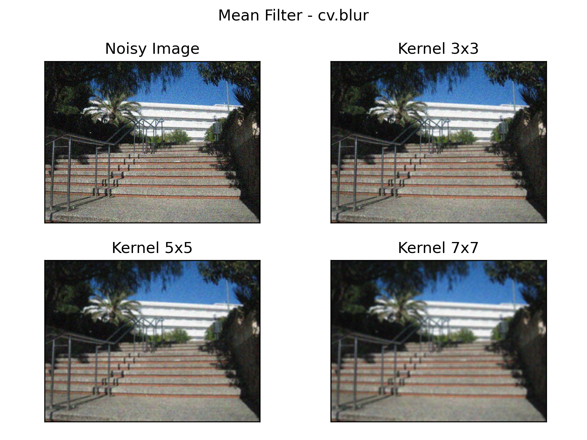
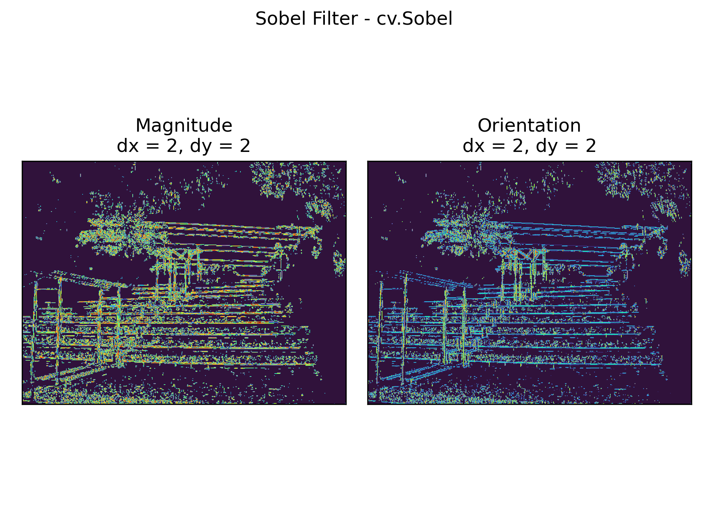
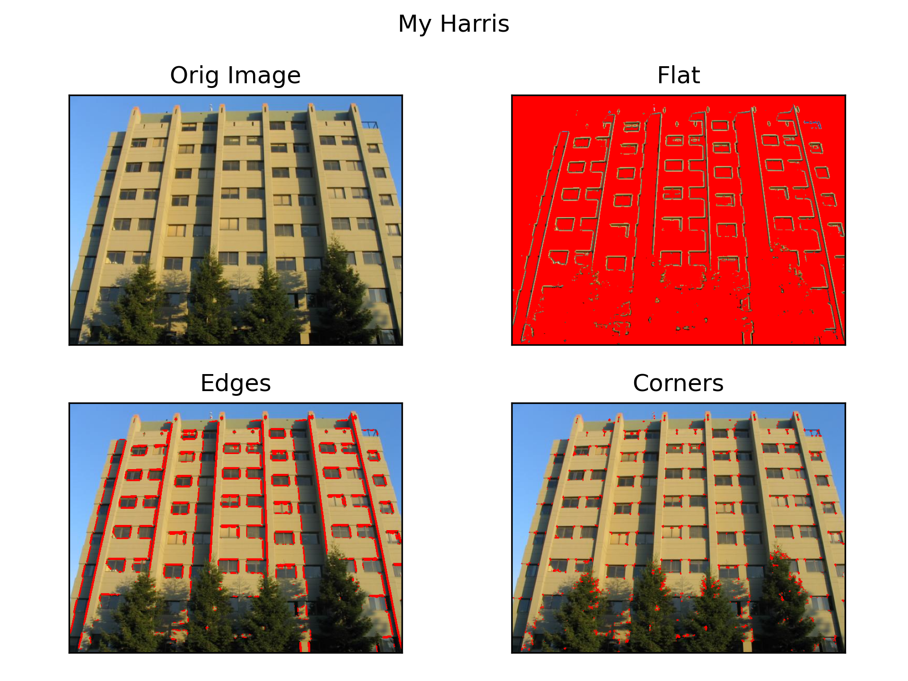
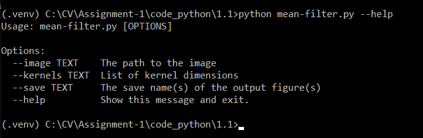
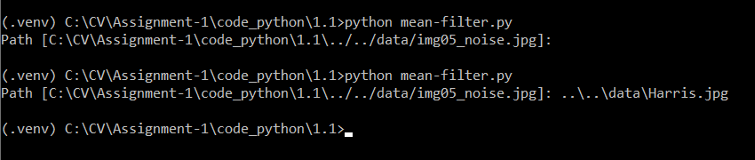
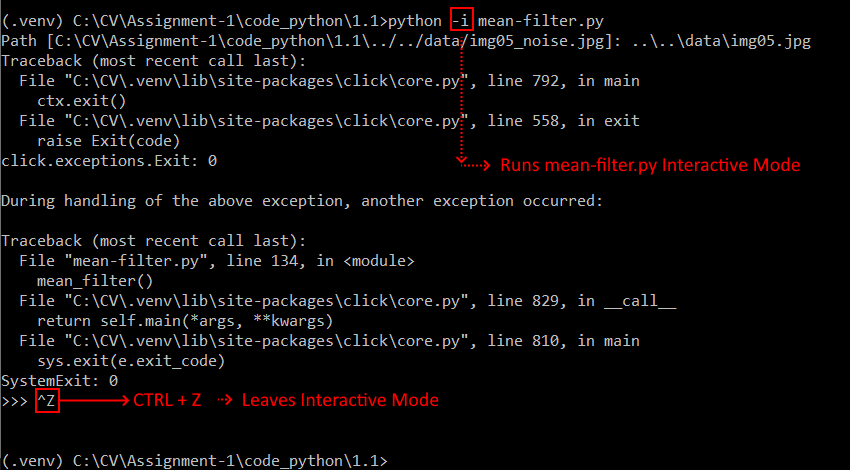

# Computer Vision
### Introduction
Work developed by **José Rosa** and **Ricardo Silva** as 1st Assigment of Computer Vision - MEE - ESTG.

### Images
<table>
  <tr>
    <td>
      
    </td>
    <td>
      
    </td>
    <td>
      
    </td>
  </tr>
</table>
<table>
  <tr>
   <td>
      
    </td>
   <td>
      
    </td>
  </tr>
</table>

### Run
###### Help Commands
Syntax: `python <script_name.py> --help`
```sh
python noise-remove.py --help
```
```sh
python gaussian-filter-sigma.py --help
```
```sh
python edge-extract.py --help
```

###### Example Commands
Syntax: `python <script_name.py> [function] --[parameter] [value]`
```sh
python -i noise-remove.py gaussian-filter-sigma --sigma_x [0.25,0.5] --sigma_y [0.1,1] --crop_corner [10,10] --crop_size 16
```
```sh
python -i bilateral-filter.py --diameters [5,15] --sigma_c 200
```
```sh
python -i edge-extract.py sobel-filter-ddepth --ksize 3 --threshold 0.25
```
```sh
python -i harris-detector-animate.py --bsizes [3,5,7,9,11] --ksizes [5,7,9,15,21] --ks [0,0.01,0.02,0.04,0.06,0.08]
```

### Known Issues:
- Issue: Figures don't show when running a command.
  - Fix: Run the command with python in Interactive Mode. After execution you can exit Interacrive Mode pressing CTRL+Z. Note that if you exit Interactive Mode all opened figure windows will be closed.
  
- Issue: Figures windows text is overlapped.
  - This is caused by your resolution being not the same as the authors. You can open the `util.py` script and change the `dpi` parameter.
- Issue: Scripts aren't running. :cry:
  - The scripts were tested using `Python 3.8.6` with the following required packages installed:
    - `click 7.1.2` [download](https://pypi.org/project/click/)
    - `matplotlib 3.3.2` [download](https://pypi.org/project/matplotlib/)
    - `numpy 1.19.2` [download](https://pypi.org/project/numpy/)
    - `opencv-python 4.4.0.44` [download](https://pypi.org/project/opencv-python/)
    - `packaging 20.4` - [download](https://pypi.org/project/packaging/)
- **Read the README.txt files!**

### Structure
 - code_python: All the source code is here
   - 1.1: Source code that implements noise remove algoritms
     - noise-remove.py: Wraps all the scripts.
       Get list of functions: `python noise-remove.py --help`
       Example: 
       ```sh
       python -i noise-remove.py original-pictures
       ```
   - 1.2: Source code that implemente edge extraction algoritms
     - edge-extract.py: Wraps all the scripts.
       Get list of functions: ```python edge-extract.py --help```
       Example:
       ```sh
       python -i edge-extract.py sobel-filter
       ```
   - 1.3: Source code that implemente corner extract algoritms
     - corner-extract.py: Wraps all the scripts.
       Get list of functions: ```python corner-extract.py --help```
       Example:
       ```sh
       python -i corner-extract.py harris-detector
       ```
   - my_Harris:
     - my-harris.py: Custom Harris Implementation.
       Get list of parameters: ```python my-harris.py --help```
       Example:
       ```sh
       python -i my-harris.py
       ```
     - my-harris-compare.py: Comparison between Custom Harris Implementation and OpenCV Harris.
       Get list of parameters: ```python my-harris-compare.py --help```
       Example:
       ```sh
       python -i my-harris-compare.py
       ```
   - Easy_Run.py: Prompts a console menu which helps the user to run a desired function.
 - data: Folder with images to use in the functions.
 - papers: References used to build the scripts.

### Contribute
Feel free to contribute, submit sugestions and error reports.

### Licence
MIT LICENSED: It permits users to do anything with a given project as long as they credit the developer and don’t hold him or her liable for the project’s use.
